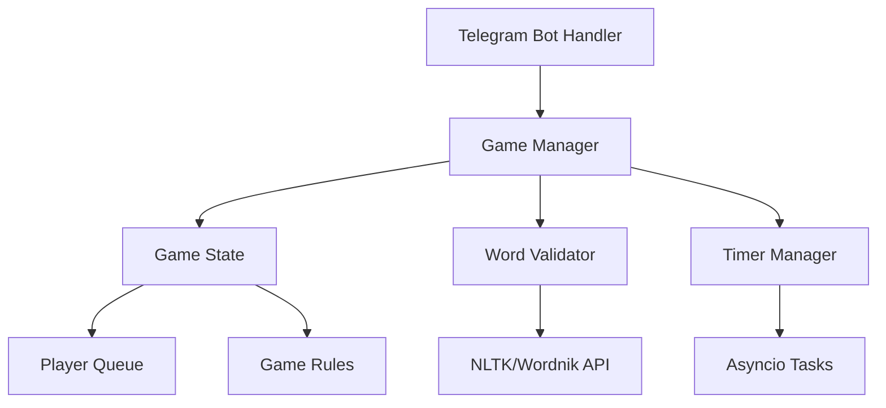

# Design Document

## Overview

The Telegram Word Game Bot is an async Python application that manages turn-based word games in Telegram group chats. The bot uses the python-telegram-bot library to handle Telegram interactions and integrates with word validation services to ensure game integrity. The architecture follows a modular design with clear separation between game logic, Telegram handling, and word validation.

## Architecture

The system follows a layered architecture pattern:



### Core Components:
- **Bot Handler**: Manages Telegram API interactions and command routing
- **Game Manager**: Orchestrates game flow and state transitions
- **Game State**: Maintains current game data for each chat
- **Word Validator**: Handles dictionary lookups and word verification
- **Timer Manager**: Manages turn timeouts using asyncio tasks
- **Player Queue**: Tracks turn order and player management

## Components and Interfaces

### TelegramBot Class
```python
class TelegramBot:
    async def start_game_command(update, context)
    async def stop_game_command(update, context)
    async def status_command(update, context)
    async def handle_message(update, context)
    async def send_turn_announcement(chat_id, player, letter, length)
```

### GameManager Class
```python
class GameManager:
    def __init__(self, word_validator: WordValidator)
    async def start_game(chat_id: int, players: List[Player]) -> GameState
    async def process_word(chat_id: int, player_id: int, word: str) -> GameResult
    async def handle_timeout(chat_id: int) -> None
    def get_game_status(chat_id: int) -> Optional[GameState]
    async def stop_game(chat_id: int) -> bool
```

### GameState Class
```python
@dataclass
class GameState:
    chat_id: int
    current_letter: str
    required_length: int
    current_player_index: int
    players: List[Player]
    is_active: bool
    turn_start_time: datetime
    timer_task: Optional[asyncio.Task]
```

### WordValidator Class
```python
class WordValidator:
    def __init__(self, use_nltk: bool = True, wordnik_api_key: str = None)
    async def validate_word(word: str) -> bool
    async def is_service_available() -> bool
```

### Player Class
```python
@dataclass
class Player:
    user_id: int
    username: str
    first_name: str
    is_active: bool = True
```

## Data Models

### Game Storage
- **In-Memory Storage**: Games stored in dictionary keyed by chat_id
- **Game Persistence**: No persistence required - games reset on bot restart
- **Concurrent Games**: Support multiple simultaneous games across different chats

### Word Validation Strategy
- **Primary**: NLTK WordNet corpus for offline validation
- **Fallback**: Wordnik API for comprehensive dictionary coverage
- **Caching**: Cache validation results to improve performance

### Timer Management
- **Asyncio Tasks**: Each game turn creates a cancellable timer task
- **Cleanup**: Automatic task cleanup on game end or valid word submission
- **Precision**: 30-second timeout with 1-second announcement intervals

## Error Handling

### Network Errors
```python
async def handle_telegram_error(error: TelegramError):
    if error.message == "Bad Request: chat not found":
        # Remove game state for deleted chats
        await game_manager.cleanup_chat(chat_id)
    elif "timeout" in error.message.lower():
        # Retry with exponential backoff
        await asyncio.sleep(retry_delay)
```

### Validation Service Failures
```python
async def validate_with_fallback(word: str) -> bool:
    try:
        return await nltk_validator.validate(word)
    except Exception:
        try:
            return await wordnik_validator.validate(word)
        except Exception:
            # Graceful degradation - pause game
            raise ValidationServiceUnavailable()
```

### Game State Corruption
- **Validation**: Validate game state before each operation
- **Recovery**: Reset corrupted games with user notification
- **Logging**: Comprehensive logging for debugging state issues

## Testing Strategy

### Unit Tests
```python
# Test game logic independently
class TestGameManager:
    async def test_start_game_creates_valid_state()
    async def test_valid_word_advances_game()
    async def test_invalid_word_maintains_state()
    async def test_timeout_skips_player()

# Test word validation
class TestWordValidator:
    async def test_valid_english_words()
    async def test_invalid_words_rejected()
    async def test_fallback_on_service_failure()
```

### Integration Tests
```python
# Test bot commands end-to-end
class TestBotCommands:
    async def test_start_game_flow()
    async def test_complete_game_round()
    async def test_concurrent_games()
    async def test_player_management()
```

### Performance Tests
- **Load Testing**: Simulate multiple concurrent games
- **Memory Testing**: Monitor memory usage during long games
- **API Rate Limiting**: Test Wordnik API rate limit handling

## Configuration Management

### Environment Variables
```python
BOT_TOKEN = os.getenv("TELEGRAM_BOT_TOKEN")
WORDNIK_API_KEY = os.getenv("WORDNIK_API_KEY", None)
LOG_LEVEL = os.getenv("LOG_LEVEL", "INFO")
TURN_TIMEOUT_SECONDS = int(os.getenv("TURN_TIMEOUT", "30"))
MAX_CONCURRENT_GAMES = int(os.getenv("MAX_GAMES", "100"))
```

### Game Configuration
```python
@dataclass
class GameConfig:
    turn_timeout: int = 30
    min_word_length: int = 1
    max_word_length: int = 20
    max_players_per_game: int = 10
    timeout_warnings: List[int] = field(default_factory=lambda: [10, 5])
```

## Deployment Considerations

### Dependencies
- **python-telegram-bot[all]**: Latest async version (v20+)
- **nltk**: For offline word validation
- **aiohttp**: For Wordnik API calls
- **python-dotenv**: Environment configuration

### Resource Requirements
- **Memory**: ~50MB base + ~1MB per active game
- **CPU**: Minimal - mostly I/O bound operations
- **Network**: Telegram API calls + optional Wordnik API

### Monitoring
- **Health Checks**: Bot responsiveness monitoring
- **Game Metrics**: Active games, player counts, word validation rates
- **Error Tracking**: Failed API calls, validation errors, timeout issues